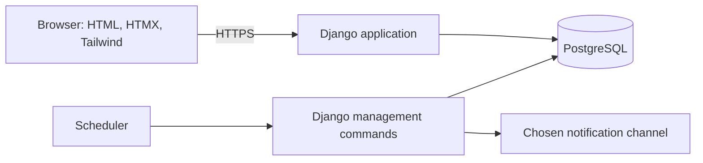

# DailyNest architecture

One Django application serves the household interface and uses PostgreSQL for data. Django templates render pages, HTMX refreshes sections, and Tailwind CSS provides responsive styling. Requirements: `_docs/plan.md`. Backlog: `_docs/tasks.md`.

## Technology choices, versions, and alternatives

Checked **17 September 2026** against official sources. No versions were previously pinned or installed, so there is no existing dependency to upgrade. These are proposed setup versions; verify compatibility and pin dependencies during setup.

| Choice | Purpose | Current versions / newer options | Alternatives and tradeoffs |
|---|---|---|---|
| Python | Run Django | Latest stable listed: **3.14.7**; **3.15** is a prerelease. Recommend 3.14.7. [Source](https://www.python.org/downloads/) | Python 3.13 if dependencies or hosting require it; another language changes the backend stack. |
| Django | Backend, authentication, forms, ORM | Latest official: **6.1.1**; supported LTS: **5.2.17**, through April 2028. Recommend 5.2.17 for longer support; 6.1.1 offers newer features. [Source](https://www.djangoproject.com/download/) | FastAPI for an API-focused app with more auth/admin assembly; Flask for a smaller foundation with more integration work. |
| Django templates | Full pages and HTML fragments | Bundled with Django; same version, no separate upgrade. | Jinja2 for a different template language; React/Vue for richer client-side state, with an additional frontend layer. |
| HTMX | Submit forms and refresh sections | **4.0.0** is released; **2.0.10** is the documented 2.x option. npm's `latest` remains on 2.x until 2027. Recommend 2.0.10 for the established line; evaluate 4.0.0 during setup. [2.x](https://htmx.org/docs/), [4.0 release](https://four.htmx.org/announcements/2026-08-28-htmx-4.0.0-is-released) | Ordinary forms are simplest but reload pages; Turbo also updates server-rendered HTML. |
| Tailwind CSS | Responsive styling | Latest official repository release: **4.3.3**. Recommend 4.3.3 after checking browser requirements. [Release](https://github.com/tailwindlabs/tailwindcss/releases/tag/v4.3.3), [browser support](https://tailwindcss.com/docs/upgrade-guide) | Bootstrap has ready-made components and can avoid a build step; plain CSS removes the framework but needs more styling work. |
| PostgreSQL | Store data and enforce constraints | Latest stable listed: **18.6**; **19 Beta 3** is a prerelease. Recommend 18.6 if supported by the host, otherwise a supported major with its latest patch. [Source](https://www.postgresql.org/) | SQLite simplifies local setup but differs in locking/concurrency; MySQL is another relational database with different behavior. |
| Node.js | Build CSS assets | Latest LTS: **24.21.0**; newer Current: **26.9.0**. Recommend LTS for build tooling; it is not the application server. [Source](https://nodejs.org/en/about/previous-releases) | Tailwind standalone CLI removes Node.js; Bootstrap or plain CSS can remove the CSS build. |
| Hosting scheduler | Run recurring jobs | No product chosen, so no version comparison yet. | Host-managed jobs for convenience; cron on a managed server; Celery plus a broker for larger workloads, with more infrastructure. |
| Notification adapter | Deliver reminders | Application-owned interface, not a separately versioned product; provider and channel undecided. | SMTP or an email provider; PostgreSQL-backed in-app messages; web push adds subscription and permission handling. |

## System overview

Web requests and scheduled commands share business services. Deploy one web service, PostgreSQL, and scheduled jobs using the same application release. Compile CSS during the build and serve it as static assets.

## Django apps

| App | Responsibility |
|---|---|
| `accounts` | Email accounts, login/logout, password recovery |
| `households` | Households, memberships, invitations, permissions |
| `chores` | Definitions, occurrences, recurrence, assignment, completion, comments, custom fields |
| `notifications` | Reminder selection, delivery records, retries |
| `dashboard` | Due-soon/overdue sections, calendar, history, fairness |

Views handle HTTP, forms validate input, services apply business rules, and models store data. Use Django session authentication; household owner permissions are separate from Django's maintenance admin.

## Data and rules

- Users join households through memberships and authenticated invitation acceptance.
- Chore definitions describe one-time chores or recurring series; occurrences hold individual deadlines, assignments, and historical snapshots.
- Each occurrence has comments and at most one completion. Store who marked it complete separately from who receives fairness credit.
- Households define custom fields; validate values and preserve their historical labels and values.
- Reminder records track occurrence, recipient, channel, stage, deadline revision, delivery status, and attempts.

Scope every read and write to household membership and enforce permissions on the server, including HTMX requests. Use transactions and constraints to prevent duplicate claims, completions, occurrences, and reminder records. Archive records when deletion would destroy history.

## Background jobs

`generate_occurrences` creates upcoming recurring work. `process_reminders` selects and delivers due/overdue reminders. The scheduler invokes both even when nobody visits the app; repeated runs must be safe.

Calculate schedules in the household timezone and store resolved deadlines in UTC. Keep delivery records and retry failures; external sends can duplicate after a lost response unless the provider supports idempotency.

**Recommendation:** retain Django + templates + HTMX + Tailwind + PostgreSQL. Alternatives are comparisons, not changes to the chosen stack or backlog.

## Decisions and verification

Complete backlog task 2 before policy-dependent work: permissions, edit/delete rules, recurrence/timezones, invitations, reminder channels/timing, and fairness credit. Select hosting and notification providers during deployment work.

Start with an empty project and passing test. Verify household isolation, concurrent claims, recurring deadlines, reminder retries, mobile forms, and a complete two-member journey. No application code is introduced by this document.
